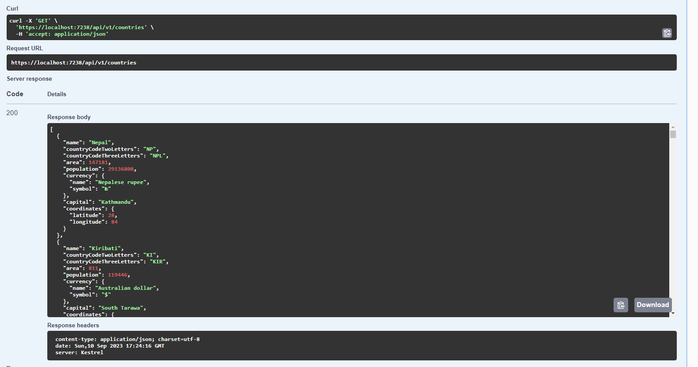
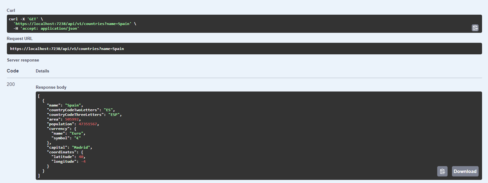
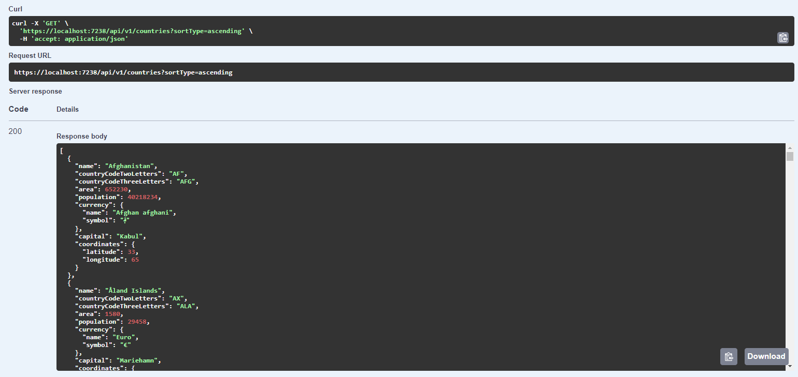
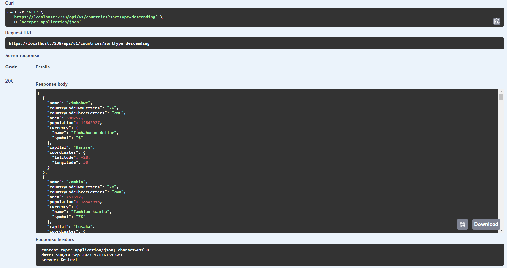
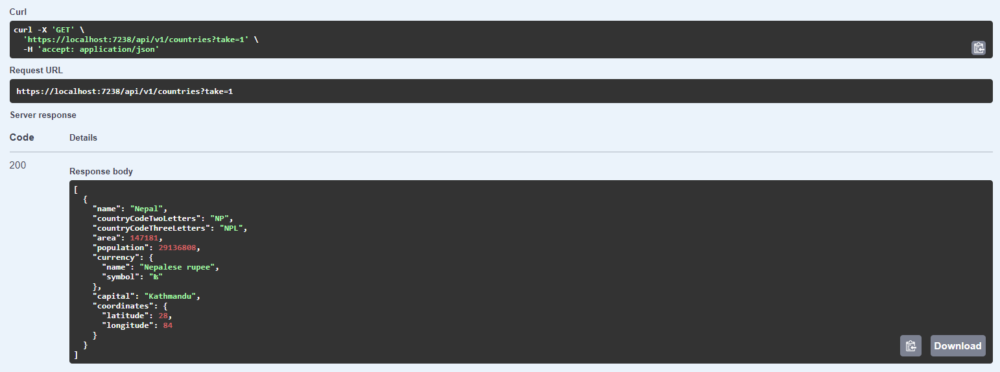
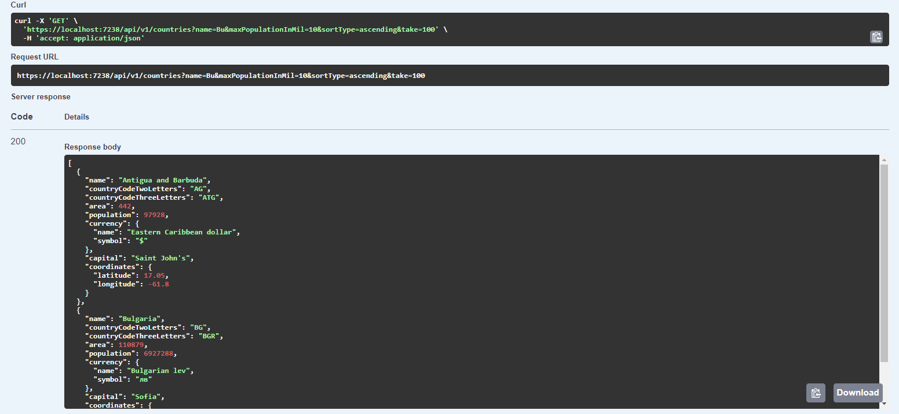
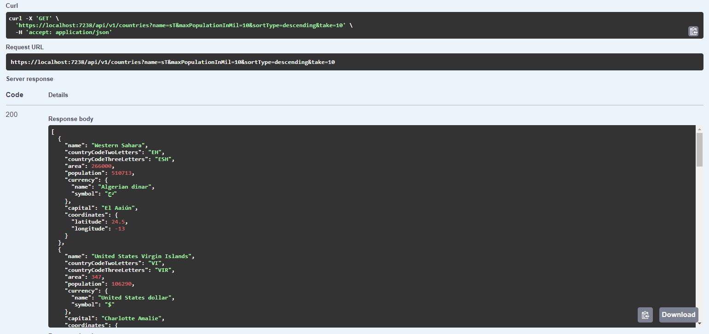
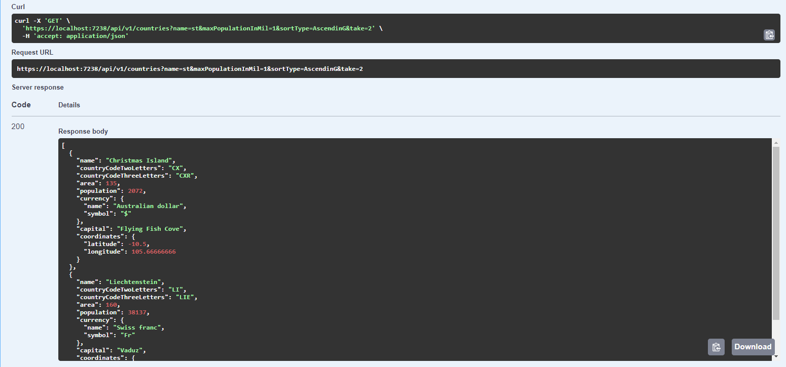

# Overview
This project provides a way for other applications to obtain countries in a intuitive and industry standard way. A REST endpoint can be used to filter and sort the result set. Additionally there is a pagination functionality. No authentication is required and the API is free to use.

Please make note that this project is not actively maintained. You can use it as it is, no warranty or support is provided. Feel free to fork it and extend it.

# Examples

## Example 1 - No filters / Return all countries

## Example 2 - Filter by name

## Example 3 - Filter by partial name

## Example 4 - Filter max population (in millions)

## Example 5 - Sort by name (Ascending)

## Example 6 - Sort by name (Descending)

## Example 7 - Take

## Example 8 - Combined #1

## Example 9 - Combined #2

## Example 10 - Combined #3
